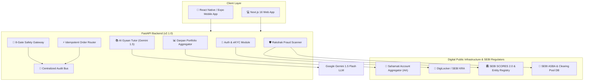

# Dhan Sarthi (धन सारथी) 🚀
> **SEBI Multi-Asset Super App for Retail Investors, Financial Awareness & Protection**  
> *"हर निवेशक की ताकत — Har Investor Ki Taaqat"*

[](https://www.sebi.gov.in)
[](https://www.python.org/)
[](https://fastapi.tiangolo.com/)
[](https://expo.dev/)
[](https://nextjs.org/)
[](backend/tests/)
[](LICENSE)

---

## 📌 Executive Summary

**Dhan Sarthi** is a SEBI-aligned, multi-asset super application engineered for retail investors in India. Built for the **SEBI Securities Market TechSprint**, Dhan Sarthi bridges the gap between complex financial markets and first-time retail investors. 

By integrating **Sahamati Account Aggregator (AA)** DPI framework, **DigiLocker eKYC**, **Google Gemini 1.5 Flash AI Reasoning Engine**, and a **Server-Enforced 8-Gate Investment Authorization Gateway**, Dhan Sarthi empowers investors with unified portfolio tracking, AI-guided suitability verification, certified multi-lingual financial education, and real-time fraud protection.

---

## 🏗️ System Architecture



---

## 🎯 Detailed Evaluation Criteria Analysis

### 1. Market Impact (Investor Protection, Efficiency & Accessibility)

* **Robust Investor Protection**:
  * **Dhan Rakshak Fraud Scanner**: Employs AI pattern matching and SEBI database checks to analyze suspicious WhatsApp/Telegram investment tips, SMS frauds, unverified financial advisors, unauthorized UPI handles, and non-ASBA bank accounts.
  * **Dhan Marg 8-Gate Engine**: Server-enforced safety gateway that evaluates product risk against investor risk profiles, knowledge scores, and portfolio concentration limits before allowing order placement.
  * **Contextual Smart Checkpoints**: Intercepts high-risk asset purchases (e.g., REITs, InvITs, Corporate Debt) with 3-minute mandatory learning checks.
* **Market Efficiency & Financial Inclusion**:
  * **Dhan Darpan Unified Mirror**: Replaces fragmented broker apps by offering a single-window consolidated net worth across brokers (Zerodha, Groww, Kuvera), depositories (CDSL, NSDL), CAMS/KFintech, Sovereign Gold Bonds (SGB), and RBI Retail Direct.
  * **Multi-Lingual AI Financial Education**: Supports **6 Indian languages** (English, Hindi, Punjabi, Tamil, Telugu, Marathi) to bring Tier-2/3/4 retail investors into formal financial markets.
* **Regulatory Compliance & Transparency**:
  * Emits real-time, immutable audit logs with severity levels for every investment authorization, scam detection, and order event.

---

### 2. Technology Stack (AI/ML, NLP, DPI & Core Engineering)

* **Artificial Intelligence & Natural Language Processing (NLP)**:
  * **Google Gemini 1.5 Flash LLM**: Powers the **AI Gyaan Tutor** for dynamic, conversational financial education. Generates native-language explanations, relatable Indian analogies (e.g. potluck meal for Mutual Funds, commercial rent share for REITs), risk disclaimers, and customized self-assessment quizzes.
  * **NLP Heuristic Pattern Matcher**: Instant pattern recognition engine scanning text inputs for illegal promises of "guaranteed returns", "sure-shot jackpot tips", and un-registered group solicitations.
* **Digital Public Infrastructure (DPI) & SEBI Ecosystem**:
  * **Sahamati Account Aggregator (AA)**: Encrypted, consent-based, read-only data fetching from Financial Information Providers (FIPs).
  * **DigiLocker / SEBI KRA**: Paperless one-time eKYC identity verification.
  * **SEBI ASBA & Broker Clearing Pool Validation**: Real-time Regex & database verification of IFSC and bank accounts against authorized SEBI clearing member handles (`@dfc`, `@icici`, `@hdfc`).
  * **SEBI SCORES 2.0 & Entity Database**: Live verification of SEBI-registered Stock Brokers, Portfolio Managers, and Research Analysts.
* **Core Technology Stack**:
  * **Backend**: Python 3.10+, FastAPI, Pydantic v2, SQLAlchemy, SQLite (PostgreSQL production-ready), Uvicorn, Pytest.
  * **Mobile Client**: React Native, Expo, React Navigation, Lucide React Native, TypeScript.
  * **Web Client**: Next.js 16 (App Router), React, Tailwind CSS, Recharts, TypeScript.
  * **Order Router**: Idempotent execution via `Idempotency-Key` headers to eliminate duplicate transaction submissions.

---

### 3. Feasibility (Real-World Deployability & Implementation)

* **Production-Ready Architecture**:
  * Built using standardized RESTful APIs with interactive OpenAPI/Swagger documentation at `/docs`.
  * Clean separation of concerns (`app/api/v1/`, `app/models/`, `app/services/`, `app/core/`).
* **Broker & Depository Integration Readiness**:
  * Direct compatibility with regulated broker APIs (Zerodha Kite, Groww Direct) and standard Account Aggregator data formats.
* **Seamless Multi-Platform Mobile Deployment**:
  * Mobile client built with Expo, allowing instant cross-platform distribution (Android APK, iOS, Web preview, Expo Go).

---

### 4. Scalability (Operational Capacity & Transaction Velocity)

* **Stateless High-Velocity API Service**:
  * FastAPI's asynchronous architecture handles concurrent user sessions with low latency and minimal memory overhead.
* **Asynchronous Audit Event Bus**:
  * Non-blocking `publish_event` mechanism decoupling log generation from API response paths; ready for enterprise scaling using Apache Kafka or Redis Streams.
* **Tokenized DPI Consent Caching**:
  * Active consent handles (`mock-consent-handle-...`) allow persistent multi-depository synchronization without repetitive user login friction.
* **Extensible Multi-Asset Data Model**:
  * Unified schema supporting Equities, Mutual Funds, Sovereign Gold Bonds, Corporate Debt, REITs, G-Secs, and InvITs.

---

### 5. Alignment with SEBI's Mandate (Protection, Development & Supervision)

* **Investor Protection**: 
  * The 8-Gate Safety Engine operates strictly server-side—preventing frontend UI manipulation or bypass of suitability checks.
* **Market Development**:
  * Certified financial literacy tracks (aligned with NISM modules), gamified learning streaks, and Gyaan Coins transition speculative retail participants into informed, long-term asset allocators.
* **Regulatory Supervision**:
  * Exposes dedicated compliance endpoints (`/api/v1/audit/events` and `/api/v1/audit/events/summary`) enabling SEBI compliance officers to inspect audit logs, flagged fraud attempts, and suitability overrides in real time.

---

## 🌟 Core Pillars & Feature Suite

```
  ┌─────────────────────────────────────────────────────────────────────────┐
  │                           DHAN SARTHI SUPER APP                         │
  ├───────────────────┬───────────────────┬───────────────────┬─────────────┤
  │   DHAN DARPAN     │    DHAN GYAAN     │     DHAN MARG     │DHAN RAKSHAK │
  │ Unified Portfolio │ AI Awareness Hub  │ Suitability Engine│Scam Scanner │
  └───────────────────┴───────────────────┴───────────────────┴─────────────┘
```

### 📊 1. Dhan Darpan (Unified Portfolio Mirror)
* **Cross-Broker Aggregation**: Tracks holdings across Zerodha, Groww, Kuvera, CDSL, NSDL, CAMS, and RBI Retail Direct.
* **Sahamati AA Integration**: Read-only, encrypted portfolio synchronization via Account Aggregator consent handles.
* **Portfolio Health Score**: AI-driven concentration risk analysis (Equity vs. Debt vs. Gold) with instant rebalancing alerts.

### 📚 2. Dhan Gyaan (Investor Awareness & Learning Hub)
* **AI Financial Assistant**: Multi-lingual natural language Q&A powered by Google Gemini 1.5 Flash LLM.
* **NISM-Aligned Learning Journey**: Certified education modules covering Securities Markets, eKYC Rights, and Riskometer asset classes.
* **Financial Simulators**: Interactive compounding and SIP calculators.
* **Gamified Rewards**: Earn Gyaan Coins and unlock accomplishment badges upon completing learning milestones.

### 🎯 3. Dhan Marg (Investment Avenue Suitability Engine & 8-Gate Gateway)
* **Risk Tolerance Assessment**: Classifies investors into Conservative, Moderate, or Aggressive profiles.
* **Backend-Enforced 8-Gate Authorization Gateway**:
  1. *Gate 1: Eligibility Check* (KYC + Active AA Consent)
  2. *Gate 2: Risk Profile Match* (Product Risk ≤ Investor Risk)
  3. *Gate 3: Suitability Engine Score* (Multi-factor score ≥ 60/100)
  4. *Gate 4: Knowledge Check* (Quiz Score ≥ 50/100)
  5. *Gate 5: Portfolio Concentration Check* (Asset class limit enforcement)
  6. *Gate 6: Rakshak Safety Check* (Entity verification & scam scan)
  7. *Gate 7: Mandatory Disclosures* (Investor risk acknowledgment)
  8. *Gate 8: Structured Authorization Object Emission*
* **Idempotent Order Router**: Safe execution flow with `Idempotency-Key` deduplication.

### 🛡️ 4. Dhan Rakshak (Spot A Scam & Fraud Protection)
* **AI Fraud & Scam Scanner**: Evaluates investment messages and social media tips for fraudulent indicators.
* **SEBI Entity Verification**: Live lookup against SEBI-registered brokers, advisers, and depository participants.
* **UPI Handle Verification**: Validates payment handles against authorized SEBI clearing member handles (`@dfc`, `@icici`, `@hdfc`).
* **ASBA Account Check**: Validates bank account numbers against SEBI clearing pool databases to block transfers to unregistered accounts.
* **SCORES 2.0 Redirection**: Direct guidance for filing investor complaints on SEBI's SCORES 2.0 portal.

### 📜 5. Centralized Audit & Event Bus
* **Immutable Event Logging**: Logs system-wide activities (`SUITABILITY_COMPLETED`, `SCAM_DETECTED`, `ORDER_CREATED`, `AA_CONSENT_GRANTED`).
* **SEBI Supervision Portal**: Compliance API endpoints providing log summaries and severity filtering.

---

## ⚡ Backend REST API Specification

| Endpoint | Method | Description |
| :--- | :--- | :--- |
| `/api/v1/health` | `GET` | Health check endpoint returning backend database and audit bus status. |
| `/api/v1/auth/register` | `POST` | User registration & authentication. |
| `/api/v1/auth/ekyc` | `POST` | DigiLocker eKYC identity verification. |
| `/api/v1/mock-dpi/aa/consent` | `POST` | Create Sahamati Account Aggregator consent handle. |
| `/api/v1/mock-dpi/aa/fetch-holdings/{handle}` | `GET` | Synchronize multi-broker holdings via AA consent. |
| `/api/v1/ai/ask-gyaan` | `POST` | Gemini 1.5 Flash AI multi-lingual Q&A & quiz generator. |
| `/api/v1/ai/before-you-invest` | `POST` | Pre-investment knowledge readiness check. |
| `/api/v1/ai/smart-checkpoint` | `POST` | Contextual investment quiz and score evaluation. |
| `/api/v1/ai/security/check-scam` | `POST` | AI & heuristic scam tip scanner. |
| `/api/v1/ai/security/verify-entity` | `POST` | Verify broker/adviser against SEBI registration DB. |
| `/api/v1/ai/security/verify-upi` | `POST` | Validate payment handle against SEBI clearing handles. |
| `/api/v1/ai/security/verify-account` | `POST` | Validate bank account against SEBI ASBA clearing pools. |
| `/api/v1/gateway/authorize` | `POST` | Execute 8-Gate Investment Authorization Gateway. |
| `/api/v1/orders/create` | `POST` | Idempotent order placement (requires Authorization ID). |
| `/api/v1/audit/events` | `GET` | Query immutable audit log events (SEBI Compliance Interface). |
| `/api/v1/audit/events/summary` | `GET` | Compliance summary metrics breakdown by severity. |

---

## 📁 Repository Structure

```
Dhan-Sarthi/
├── backend/                      # FastAPI Microservice Backend
│   ├── app/
│   │   ├── api/v1/              # API Route Controllers (Auth, Gateway, AI, Orders, Audit, DPI)
│   │   ├── core/                # Core Config, Database, and Audit Event Bus
│   │   ├── models/              # SQLAlchemy Database Schemas
│   │   ├── services/            # Business Logic (8-Gate Authorization Engine)
│   │   └── main.py              # FastAPI Application Entrypoint
│   ├── tests/                   # Pytest Test Suite (33 Unit Tests)
│   └── requirements.txt         # Python Dependencies
├── mobile/                       # React Native Expo Mobile Client
│   ├── screens/
│   │   ├── darpan/              # Dhan Darpan (Portfolio Mirror, Insights, Risk)
│   │   ├── gyaan/               # Dhan Gyaan (AI Tutor, Journey, Quizzes, Simulators)
│   │   ├── marg/                # Dhan Marg (Suitability, Horizon, 8-Gate Flow)
│   │   └── rakshak/             # Dhan Rakshak (Scam Scanner, Entity Verification)
│   ├── App.tsx                  # Root Navigation Container
│   └── package.json             # React Native Dependencies
└── frontend/                     # Next.js 16 Web Client
    ├── src/
    │   ├── app/                 # Next.js App Router Pages
    │   └── components/          # Web UI Dashboard Components
    └── package.json
```

---

## 🚀 Quick Start & Installation Guide

### Prerequisites
- **Node.js**: v18.0 or higher
- **Python**: v3.10 or higher
- **Expo Go** app on iOS/Android (optional for mobile testing)

---

### 1. Backend Service Setup (FastAPI)

```bash
# 1. Navigate to backend directory
cd backend

# 2. Create and activate virtual environment (Windows)
python -m venv venv
.\venv\Scripts\activate

# (On macOS/Linux)
# python3 -m venv venv
# source venv/bin/activate

# 3. Install backend dependencies
pip install -r requirements.txt

# 4. Set optional Gemini API key (defaults to rule-engine fallback if omitted)
# set GEMINI_API_KEY=your_google_gemini_api_key

# 5. Launch FastAPI development server
python -m uvicorn app.main:app --host 0.0.0.0 --port 8000 --reload
```
> 🌐 Backend server will run at `http://localhost:8000`.  
> 📑 Interactive Swagger API docs are accessible at `http://localhost:8000/docs`.

---

### 2. Mobile Client Setup (React Native / Expo)

```bash
# Open a new terminal and navigate to mobile directory
cd mobile

# Install dependencies
npm install

# Start Expo development server
npx expo start
```
> 📱 Scan the generated QR code using **Expo Go** on Android/iOS, or press `a` for Android Emulator / `w` for Web preview.

---

### 3. Web Client Setup (Next.js 16)

```bash
# Open a new terminal and navigate to frontend directory
cd frontend

# Install dependencies
npm install

# Start Next.js web application
npm run dev
```
> 💻 Web Dashboard will be available at `http://localhost:3000`.

---

## 🧪 Automated Test Suite Execution

The backend contains a unit test suite verifying all 8 authorization gates, AI features, scam scanners, order router idempotency, and audit log generation.

To run the full test suite:

```bash
cd backend
.\venv\Scripts\pytest
```

### Test Results Summary:
```
======================== 33 passed in 7.43s ========================
tests/test_ai_features.py .................. [PASSED]
tests/test_audit.py ........................ [PASSED]
tests/test_auth.py ......................... [PASSED]
tests/test_consent.py ...................... [PASSED]
tests/test_dhan_gyaan_full_suite.py ........ [PASSED]
tests/test_dpi_mock.py ..................... [PASSED]
tests/test_gateway.py ...................... [PASSED]
tests/test_orders.py ....................... [PASSED]
tests/test_portfolio.py .................... [PASSED]
```

---

## 📄 License & Regulatory Note

Distributed under the **MIT License**. See `LICENSE` for details.

*Disclaimer: Dhan Sarthi is a prototype built for the SEBI Securities Market TechSprint. Simulated broker execution interfaces and mock DPI handles demonstrate production-level integration architecture compliant with SEBI regulations.*
